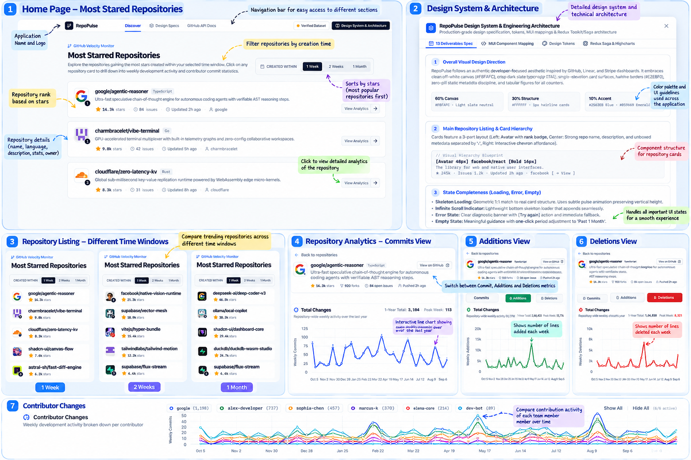

# RepoPulse 🚀

> **Developer Velocity & Repository Analytics Dashboard**  
> Explore the most-starred GitHub repositories created across recent time windows and analyze 52 weeks of development momentum and contributor trends.

[](https://santhosh-kambhampati.github.io/RepoPlus/)
[](https://react.dev/)
[](https://www.typescriptlang.org/)
[](https://redux-toolkit.js.org/)
[](https://redux-saga.js.org/)
[](https://mui.com/)
[](https://www.highcharts.com/)

---

## 📸 Overview & Demo



---

## 🌟 Key Features

### 1. Most-Starred Repository Discovery
- **Dynamic Time Filters**: Filter newly created repositories by:
  - **Last 1 Week** (past 7 days)
  - **Last 2 Weeks** (past 14 days)
  - **Last 1 Month** (past 30 days)
- **Star Velocity Ranking**: Repositories are sorted by star count in descending order.
- **Rich Repository Cards**: Displays:
  - Repository name & language badge
  - Repository description
  - Stargazers count
  - Open issues count
  - Owner avatar and username
  - Last updated / pushed relative timestamp

### 2. Comprehensive Repository Analytics
- **52-Week Activity View**: Deep dive into 1 full year of weekly repository momentum.
- **Metric Selector**: Toggle seamlessly across three core activity metrics:
  - **Commits**
  - **Additions**
  - **Deletions**
  *(Selection updates both charts simultaneously).*
- **Dual Synchronized Highcharts Visualizations**:
  - **Total Changes Chart**: Single area spline curve with soft gradient fill representing all contributors combined. Includes exact tabular figures on hover and formatted week dates.
  - **Contributor Changes Chart**: Multi-line spline chart with 1 line per contributor, custom color coordination, interactive legend toggling (individual toggle, *Show All*, *Hide All*), and exact values on hover.
  - Both charts share matching X-axis time resolutions while remaining vertically separate.

### 3. State Completeness & UX Resilience
- **Skeleton Pulse Loading**: Geometric 1:1 match to real card structure.
- **Empty & Error States**: Graceful fallback and retry affordances for rate-limited public GitHub REST endpoints.
- **Infinite Scrolling & Pagination**: Smooth infinite loading via `IntersectionObserver` with a manual fallback button.

---

## 🛠️ Architecture & Tech Stack

```
src/
├── components/                 # Reusable presentation components
│   ├── AnalyticsPage.tsx       # Repository analytics detail view
│   ├── ContributorChangesChart.tsx # Highcharts multi-line contributor chart
│   ├── TotalChangesChart.tsx   # Highcharts area chart for total activity
│   ├── RepoCard.tsx            # Repository result card
│   ├── RepoCardSkeleton.tsx    # Pulse skeleton loading component
│   ├── TimePeriodSelector.tsx  # Segmented 1w / 2w / 1m filter control
│   ├── Header.tsx              # Sticky navigation bar with view breadcrumb
│   ├── EmptyState.tsx          # Zero-results state
│   ├── ErrorState.tsx          # Error notification banner with retry options
│   └── DesignSpecModal.tsx     # Design tokens and architecture specification
├── redux/                      # Centralized state management
│   ├── store.ts                # Redux Toolkit configureStore + Redux Saga middleware
│   ├── rootReducer.ts          # Combined root reducer
│   ├── rootSaga.ts             # Root saga orchestrator
│   ├── hooks.ts                # Typed useAppDispatch & useAppSelector
│   ├── slices/
│   │   └── repositoriesSlice.ts # Repository & filter state
│   ├── sagas/
│   │   └── repositoriesSaga.ts  # Side-effect workers & action watchers
│   └── selectors/
│       └── repositoriesSelectors.ts # Memoized state selectors
├── services/
│   └── githubApi.ts            # Centralized GitHub REST API client
├── types/
│   └── index.ts                # TypeScript interfaces and domain models
├── utils/
│   └── formatters.ts           # Number, date, and color formatting utilities
├── App.tsx                     # Main application container
└── main.tsx                    # React entrypoint wrapped in Redux <Provider>
```

### Core Technologies
- **React 19** with Hooks
- **Redux Toolkit** for immutable, type-safe global application state
- **Redux Saga** for asynchronous side-effects and concurrency control
- **Material UI (MUI)** & **Tailwind CSS v4** for clean developer aesthetics
- **Highcharts** & **Highcharts React** for responsive data visualizations
- **Vite 8** with Lightning-fast HMR and ESM bundling

---

## 🚀 Getting Started Locally

### Prerequisites
- **Node.js** (v18 or higher, v20+ recommended)
- **npm** or **bun**

### 1. Clone the repository
```bash
git clone https://github.com/santhosh-kambhampati/RepoPlus.git
cd RepoPlus
```

### 2. Install dependencies
```bash
npm install
```

### 3. Start development server
```bash
npm run dev
```
Open [http://localhost:3000](http://localhost:3000) in your browser.

### 4. Build for production
```bash
npm run build
```

### 5. Run TypeScript linting / typecheck
```bash
npm run lint
```

---

## 🌐 Deployment

This project is automatically deployed to **GitHub Pages** on every push to the `main` branch via GitHub Actions workflow [`.github/workflows/deploy.yml`](.github/workflows/deploy.yml).

- **Live URL**: [https://santhosh-kambhampati.github.io/RepoPlus/](https://santhosh-kambhampati.github.io/RepoPlus/)

---

## 📄 License

MIT License © 2026 [Santhosh Kambhampati](https://github.com/santhosh-kambhampati)
